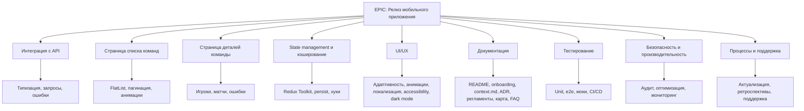

# EPIC: Подготовка мобильного приложения к релизу (расширенная)

**Описание:**
Реализовать интеграцию с football-data.org API, обеспечить корректную архитектуру, покрытие тестами, актуальную документацию и production-ready состояние мобильного приложения на React Native CLI.

**Критерии готовности:**
- Интеграция с API, поддержка пагинации, отображение команд, игроков, матчей
- Документация и onboarding актуальны
- Покрытие тестами >80% для критичных путей
- Production-ready checklist выполнен
- Безопасность и производительность на уровне production

---

## FEATURE
- Интеграция с football-data.org API (эндпоинты, типизация, валидация, обработка ошибок)
- Постраничная навигация (pagination) для списков
- Страница списка команд (FlatList, логотип, название, переход к деталям)
- Страница деталей команды (игроки, будущие матчи)
- State management: Redux Toolkit + Thunk/Saga, redux-persist, разделение Connector.ts/Screen.tsx/hooks
- Кэширование и оффлайн-режим: AsyncStorage, WCX Storage, WatermelonDB

## UI/UX
- Адаптивность, поддержка iOS/Android, SafeArea, Flexbox
- Анимации: Animated API, LayoutAnimation, Reanimated, skeleton loading, ошибки, переходы
- Локализация: Lingui.js, ICU pluralization, кэширование переводов, RTL
- Accessibility: reduce motion, accessibility-индикаторы
- Dark mode: темизация, поддержка светлой/тёмной темы

## DOCS
- README.md: структура, стек, быстрый старт, ссылки
- Onboarding для всех ролей
- context.md для всех feature
- ADR и архитектурные решения
- Регламенты: CHANGELOG.md, code review, рефакторинг, задачи, тестирование, мониторинг, аналитика, безопасность, локализация, анимации, производительность
- Визуальная карта документации (Mermaid)
- Workflow обновления документации
- FAQ по документации и архитектуре

## TESTING
- Unit-тесты: хуки, Connector.ts, Screen.tsx, utils
- E2E-тесты: MaestroDev, сценарии
- Моки API: MSW
- Покрытие тестами >80%
- CI/CD: GitHub Actions, coverage, релизы

## IMPROVEMENT
- Безопасность: .env, audit, HTTPS, helmet/cors, rate limiting, Zod, Sentry
- Производительность: профилирование, FlatList, lazy load, мемоизация
- Мониторинг и алерты: Sentry, отчёты, действия при инцидентах

## CHORE
- Актуализация и аудит документации: удаление устаревших файлов, терминов, проверка ссылок/импортов
- Обратная связь и ретроспективы
- FAQ и поддержка для новых участников

---

**Связанные задачи и подзадачи оформлены в taskmd.**

## Визуальная карта Epic (Mermaid)

