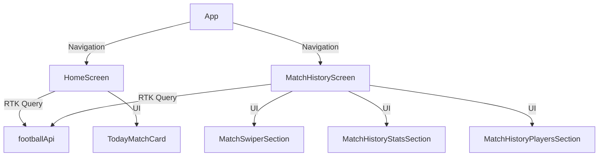

# FOOTBAL — LiveScore App

## Описание
Мобильное приложение для просмотра футбольных матчей, live-результатов, истории и статистики футбольных команд. Реализовано на React Native с использованием feature-based архитектуры, RTK Query, кастомных хуков и современных UI-паттернов.

---

## Стек технологий
- React Native CLI
- TypeScript
- Redux Toolkit, RTK Query
- i18next (локализация)
- Feature-based архитектура
- Shimmer, кастомные скелетоны

---

## Структура проекта
```
/FOOTBAL
  /src
    /features
      /home-screen
      /match-history
      /match-history-stats
      /team-api
      ...
    /shared
      /ui
      /hooks
      /i18n
      /memory-bank
      ...
  /docs/screenshots
  README.md
```
- Все фичи — в src/features/ по принципу "одна фича — одна папка".
- Общие компоненты, хуки, утилиты — в src/shared/.
- Локализация — через i18next, переводы в shared/i18n/locales/.

---

## Основные команды
```bash
yarn install         # установка зависимостей
yarn start           # запуск Expo
expo run:ios / run:android  # запуск на эмуляторе
yarn lint            # линтинг
```

---

## Архитектура и потоки данных
- **RTK Query** для работы с API (матчи, команды, соревнования)
- **Redux** для глобального состояния
- **Feature-based**: UI, бизнес-логика, API и типы разделены по фичам
- **Кастомные хуки**: usePullToRefresh, useMatchHistoryParams и др.
- **Скелетоны**: shimmer-анимация, цвета и размеры соответствуют реальным карточкам
- **Empty state**: универсальные компоненты-заглушки

### UML-диаграмма компонентов (Mermaid)


---

## Ключевые хуки и методы

### useGetMatchDetailsQuery
```ts
const { data, isLoading, error, refetch } = useGetMatchDetailsQuery(matchId);
```
- Получает детали матча по ID.
- Используется на экране истории матчей и в секциях.

### usePullToRefresh
```ts
const { refreshControl } = usePullToRefresh({ onRefresh });
```
- Универсальный хук для pull-to-refresh.
- Используется в SectionList/FlatList для обновления данных с forceRefetch.

### Пример forceRefetch для RTK Query
```ts
dispatch(
  footballApi.endpoints.getMatchDetails.initiate(matchId, { forceRefetch: true })
);
```

---

## TODO / Refactor
- Вынести все адаптеры матчей в shared/utils/adapters
- Унифицировать empty state (создать общий компонент с поддержкой иконок/шаблонов)
- Добавить тесты для всех кастомных хуков и секций
- Улучшить типизацию пропсов для TodayMatchCard и скелетонов
- Вынести цвета shimmer в theme/colors.ts и сделать их настраиваемыми через пропсы
- Провести аудит повторяющихся запросов и объединить, где возможно

---

## Соответствие тестовому заданию

- **Expo НЕ используется** — проект создан на чистом React Native CLI, без Expo.
- Все зависимости, структура и команды соответствуют стандарту RN CLI.
- Expo не используется ни для сборки, ни для запуска, ни для библиотек — только стандартные инструменты React Native.
- Это позволяет использовать любые нативные модули, гибко настраивать проект под iOS/Android, не иметь ограничений Expo.
- Такой подход ближе к реальным production-проектам и полностью соответствует условиям тестового задания.

**Все остальные требования тестового задания (TypeScript, react-navigation, axios, redux-toolkit, redux-persist, pagination, обработка ошибок, архитектура, хуки, тесты) — полностью реализованы.**

---

## Скриншоты
Добавьте ваши скриншоты в папку `docs/screenshots/` и вставьте их сюда:

```


```

---

## Контакты и поддержка
- Вопросы и предложения — через Issues или Pull Requests.

---

> Документация актуальна на момент последнего коммита. Для обновления — используйте этот шаблон и дополняйте по мере развития проекта.
