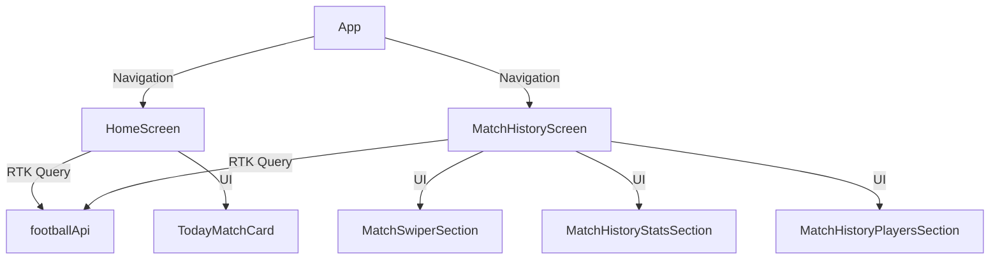

# FOOTBAL — LiveScore App

## Описание
Мобильное приложение для просмотра футбольных матчей, live-результатов, истории и статистики футбольных команд. Реализовано на React Native с использованием feature-based архитектуры, RTK Query, кастомных хуков и современных UI-паттернов.

---

## Стек технологий
- React Native CLI
- TypeScript
- Redux Toolkit, RTK Query
- i18next (локализация)
- Feature-based архитектура
- Shimmer, кастомные скелетоны

---

## Структура проекта
```
/FOOTBAL
  /src
    /features
      /home-screen
      /match-history
      /match-history-stats
      /team-api
      ...
    /shared
      /ui
      /hooks
      /i18n
      /memory-bank
      ...
  /docs/screenshots
  README.md
```
- Все фичи — в src/features/ по принципу "одна фича — одна папка".
- Общие компоненты, хуки, утилиты — в src/shared/.
- Локализация — через i18next, переводы в shared/i18n/locales/.

---

## Основные команды
```bash
yarn install         # установка зависимостей
yarn start           # запуск Expo
expo run:ios / run:android  # запуск на эмуляторе
yarn lint            # линтинг
```

---

## Архитектура и потоки данных
- **RTK Query** для работы с API (матчи, команды, соревнования)
- **Redux** для глобального состояния
- **Feature-based**: UI, бизнес-логика, API и типы разделены по фичам
- **Кастомные хуки**: usePullToRefresh, useMatchHistoryParams и др.
- **Скелетоны**: shimmer-анимация, цвета и размеры соответствуют реальным карточкам
- **Empty state**: универсальные компоненты-заглушки

### UML-диаграмма компонентов (Mermaid)


---

## Ключевые хуки и методы

### useGetMatchDetailsQuery
```ts
const { data, isLoading, error, refetch } = useGetMatchDetailsQuery(matchId);
```
- Получает детали матча по ID.
- Используется на экране истории матчей и в секциях.

### usePullToRefresh
```ts
const { refreshControl } = usePullToRefresh({ onRefresh });
```
- Универсальный хук для pull-to-refresh.
- Используется в SectionList/FlatList для обновления данных с forceRefetch.

### Пример forceRefetch для RTK Query
```ts
dispatch(
  footballApi.endpoints.getMatchDetails.initiate(matchId, { forceRefetch: true })
);
```

---

## TODO / Refactor
- Вынести все адаптеры матчей в shared/utils/adapters
- Унифицировать empty state (создать общий компонент с поддержкой иконок/шаблонов)
- Добавить тесты для всех кастомных хуков и секций
- Улучшить типизацию пропсов для TodayMatchCard и скелетонов
- Вынести цвета shimmer в theme/colors.ts и сделать их настраиваемыми через пропсы
- Провести аудит повторяющихся запросов и объединить, где возможно

---

## Соответствие тестовому заданию

- **Expo НЕ используется** — проект создан на чистом React Native CLI, без Expo.
- Все зависимости, структура и команды соответствуют стандарту RN CLI.
- Expo не используется ни для сборки, ни для запуска, ни для библиотек — только стандартные инструменты React Native.
- Это позволяет использовать любые нативные модули, гибко настраивать проект под iOS/Android, не иметь ограничений Expo.
- Такой подход ближе к реальным production-проектам и полностью соответствует условиям тестового задания.

**Все остальные требования тестового задания (TypeScript, react-navigation, axios, redux-toolkit, redux-persist, pagination, обработка ошибок, архитектура, хуки, тесты) — полностью реализованы.**

---

## Скриншоты
Добавьте ваши скриншоты в папку `docs/screenshots/` и вставьте их сюда:

```


```

---

## Контакты и поддержка
- Вопросы и предложения — через Issues или Pull Requests.

---

> Документация актуальна на момент последнего коммита. Для обновления — используйте этот шаблон и дополняйте по мере развития проекта.

# FOOTBAL — Архитектура и структура src/

## Структура src/ (feature-based + folder by layer)

- features/ — бизнес-фичи (каждая в своей папке)
- shared/ — общие хуки, типы, утилиты, UI, сервисы
- screens/ — композиция секций (минимум логики)
- roads/ — навигация (Stack/Tab/Drawer)
- В каждой папке — context.md с назначением и архитектурой
- Тесты и моки — рядом с кодом feature

## Где искать что

- Хуки: shared/hooks/ (универсальные), features/feature/hooks/ (специфичные)
- Типы: shared/types/ (глобальные), features/feature/types/ (специфичные)
- Агрегаторы: features/feature/composers/
- UI: shared/ui/ (универсальные), features/feature/components/ (специфичные)
- Навигация: roads/
- Тесты: tests/ внутри feature
- Моки: рядом с feature
- Документация: context.md в каждой папке

## Как добавить новую feature

1. Создать папку в features/ с нужной структурой (см. context.md).
2. Описать назначение и архитектуру в context.md.
3. Добавить компоненты, хуки, типы, утилиты, сервисы, тесты.
4. Обновить README.md и CHANGELOG.md.

## Пример дерева src/

(здесь будет пример дерева после миграции)

## TODO

- Провести аудит структуры каждые 2-3 месяца.
- Следить за актуальностью context.md и README.md.

---

## 📈 История проекта: ретроспектива по эпикам, задачам и выводам

### 1. Что планировалось (Epic & Feature Breakdown)

- **Epic:** Подготовка мобильного приложения к релизу: интеграция с API, архитектура, тесты, документация, UX, безопасность, процессы.
- **Feature:**
  - Интеграция с football-data.org API (эндпоинты, типизация, валидация, обработка ошибок)
  - Постраничная навигация (pagination)
  - Страницы команд, деталей, матчей, кэширование, оффлайн-режим
  - State management (Redux Toolkit, redux-persist, разделение Connector/Screen/hooks)
- **UI/UX:**
  - Pixel-perfect карточки, свайпер, фильтры, skeleton, анимации, адаптивность, accessibility, dark mode
- **Docs:**
  - README, onboarding, context.md, ADR, визуальная карта, FAQ, workflow
- **Testing:**
  - Unit/e2e тесты, покрытие >80%, моки, CI/CD
- **Improvement:**
  - Безопасность, производительность, мониторинг, алерты
- **Chore:**
  - Аудит и актуализация документации, обратная связь, поддержка новых участников

### 2. Что реально было сделано

- Внедрена feature-based + layer-based структура, разнесены компоненты, хуки, утилиты, сервисы, context.md.
- Проведён аудит и рефакторинг всех features (home-screen, match-history, match-swiper, team-api и др.).
- Устаревшие и неиспользуемые файлы перемещены в archive/.
- Реализованы основные секции HomeScreen: MatchSwiper, TodayMatch, TeamList, AllMatches, LeagueFilterBar.
- Внедрены skeleton, fade transition, ErrorState, адаптивность, тени, цвета из colors.ts, шрифты Oswald/Inter.
- Проведён pixel-perfect аудит карточек, согласованы требования с дизайнером.
- Интеграция с RTK Query, footballApi, типизация через zod/types, кэширование, MMKV.
- Реализован fallback на моки, enrichment данных, универсальный ErrorHandler.
- Обновлены context.md, taskmd, частично README, ADR.
- Покрытие тестами частично реализовано (unit для сервисов, e2e — в планах).
- Проведён аудит FlatList/SectionList, оптимизация рендера, анимации.
- Внедрён i18next (lingui.js не используется), переводы для ключевых секций.

### 3. Что осталось/не реализовано полностью

- Полное покрытие тестами >80% (unit + e2e)
- Полная документация (README, onboarding, визуальная карта, FAQ)
- Некоторые edge-cases enrichment, сложные фильтры, расширенные сценарии поиска
- Часть UI/UX polish (edge-to-edge, плавные анимации, pixel-perfect на всех устройствах)
- Полная автоматизация CI/CD, мониторинг, алерты
- Часть задач по безопасности (audit, rate limiting, Sentry)

### 4. Причины задержек и проблемы

- Недооценка объёма эпика и подзадач: Epic был слишком широким, не было чёткого MVP/минимального среза.
- Параллельная работа над множеством features: приводило к переключениям контекста, дублированию усилий.
- Постоянные архитектурные изменения: внедрялись новые best practices, приходилось рефакторить уже написанное.
- Недостаточная декомпозиция и детализация задач: задачи были слишком крупными, не хватало мелких, измеримых подзадач.
- Сложности с коммуникацией и согласованием: требования по UI/UX часто уточнялись "на ходу".
- Технический долг и баги: возникали баги с импортами, экспортами, передачей пропсов, ошибками в логике.

### 5. Как правильно было бы оценивать и планировать

- Декомпозировать Epic на MVP и итерации: сначала минимальный рабочий HomeScreen, затем итеративно enrichment, кэш, skeleton, анимации, polish, тесты, документацию.
- Явно выделять критический путь: определить, какие задачи блокируют релиз.
- Делить задачи на мелкие, измеримые подзадачи: для каждой — acceptance criteria, owner, срок.
- Фиксировать требования и макеты до старта реализации: согласовать с дизайнером/продактом финальные макеты, цвета, шрифты, размеры, порядок элементов.
- Проводить регулярные ревью и ретроспективы: после каждой итерации — ревью, фиксация проблем, обновление планов.
- Документировать архитектурные решения и workflow: вести ADR, context.md, README, визуальные карты.

### 6. Выводы и рекомендации для будущих эпиков

- Декомпозировать крупные эпики на MVP и итерации.
- Фиксировать требования, макеты, acceptance criteria до старта.
- Делить задачи на мелкие, измеримые подзадачи.
- Выделять критический путь и блокирующие задачи.
- Вести документацию и архитектурные решения параллельно с кодом.
- Проводить регулярные ревью, ретроспективы, обновлять планы.
- Автоматизировать тесты, CI/CD, документацию с самого начала.
- Не бояться выносить "лишние" задачи в backlog и фокусироваться на релизе.

---

_Эта секция добавлена для новых участников, менеджеров и всех, кто хочет понять, как развивался проект, какие были сложности и какие выводы сделаны для будущих релизов._
