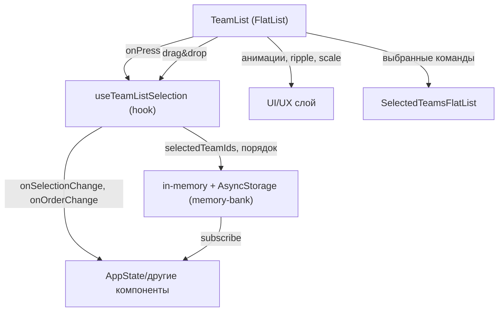

# TeamList 2.0 — возможности и задачи

## Описание
TeamList реализует горизонтальный FlatList с поддержкой мультивыбора команд (до 4), drag&drop reorder, анимациями и интеграцией с in-memory + AsyncStorage для кэширования состояния. Компонент оптимизирован для производительности, покрыт тестами и поддерживает адаптивность, темизацию, SVG-логотипы и типографику.

## Возможности
- Горизонтальный FlatList для отображения команд
- Мультивыбор команд (до 4 одновременно)
- Disable/grey-out невыбираемых при лимите
- Анимации выбора: scale (spring), ripple (#FF2D7A, alpha)
- Перемещение выбранных команд вперед FlatList (анимировано)
- Дублирующая секция: отдельный FlatList только для выбранных команд
- Drag&drop reorder выбранных команд (react-native-draggable-flatlist)
- Снятие выбора по нажатию на команду в выбранных (анимированное удаление)
- Сохранение массива выбранных id и порядка в in-memory + AsyncStorage (memory-bank)
- Трансляция изменений выбора и порядка на другие части приложения через in-memory + AsyncStorage
- Подсветка выбранных команд (рамка, фон, текст — красный)
- Typography для всех текстов, SVG-логотипы
- Покрытие unit-тестами: выбор, снятие, порядок, анимация, drag&drop, лимит

## Acceptance Criteria
- TeamList реализован на FlatList с горизонтальным скроллом
- Мультивыбор команд с ограничением до 4, остальные disable
- Анимации выбора и снятия реализованы (scale, ripple)
- Выбранные команды отображаются в отдельной секции и перемещаются вперед
- Drag&drop reorder выбранных команд работает
- Состояние выбора и порядок сохраняются в in-memory + AsyncStorage и транслируются в приложение
- Покрытие unit-тестами >80% по ключевым сценариям
- Обновлена документация и context.md 

## API TeamList (пример)

```tsx
<TeamList
  teams={teams} // Team[]
  selectedTeamIds={selectedTeamIds} // string[]
  onSelectionChange={handleSelectionChange} // (ids: string[]) => void
  maxSelection={4}
  onOrderChange={handleOrderChange} // (ids: string[]) => void
  isLoading={isLoading}
/>
```

### Пропсы
- `teams: Team[]` — массив команд для отображения
- `selectedTeamIds: string[]` — id выбранных команд
- `onSelectionChange: (ids: string[]) => void` — callback при изменении выбора
- `maxSelection?: number` — максимальное количество выбранных команд (по умолчанию 4)
- `onOrderChange?: (ids: string[]) => void` — callback при изменении порядка выбранных
- `isLoading?: boolean` — индикатор загрузки

## Mermaid: Архитектура TeamList

